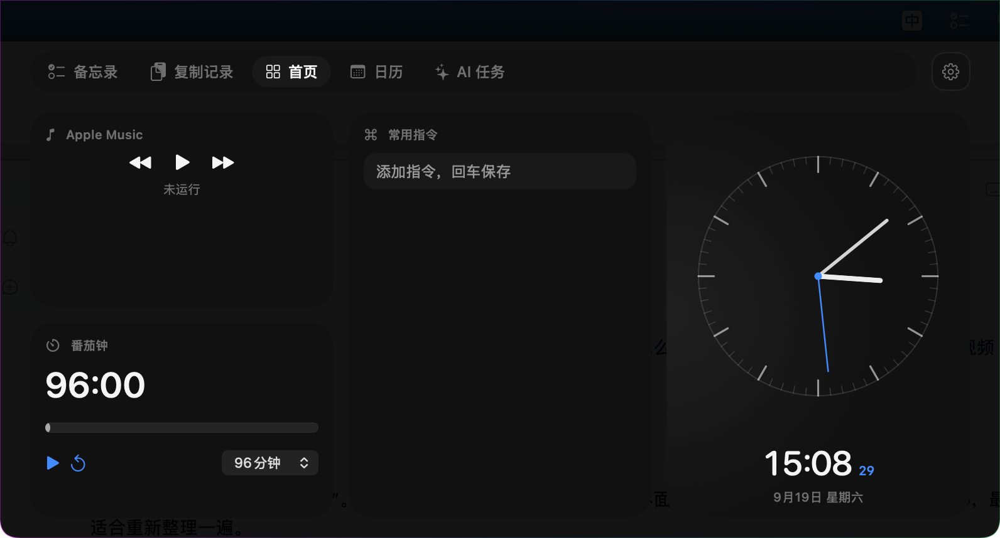
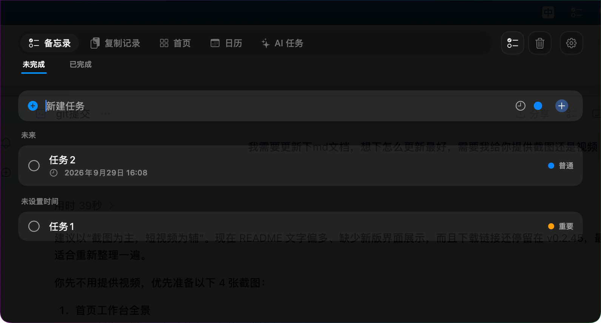
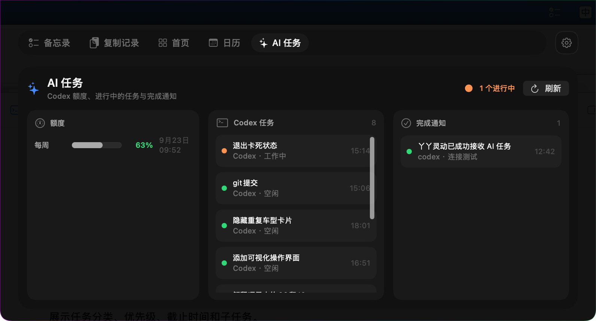

# 丫丫灵动（IslandMemo）

把 Mac 刘海变成一个随手可用的本地工作台。单击屏幕顶部中央区域，或使用自定义全局快捷键，即可快速打开备忘录、剪贴板、日历、AI 任务和专注工具。



## 核心亮点

- **自由组合工作台**：功能可放在顶部 Tab、首页模块或隐藏，首页最多展示 6 个模块
- **完整任务管理**：支持分类、子任务、优先级、截止时间、完成列表、提醒和回收站
- **复制内容转备忘录**：保留原文快速创建任务，也可选择接入大模型提炼内容和识别时间
- **本机 AI 任务状态**：查看 Codex 额度、运行状态与完成通知
- **本地优先**：任务、剪贴板、链接和录音等数据默认保存在本机

## 界面预览

### 备忘录

按未完成和已完成查看任务，并通过分类、等级和截止时间快速整理。



### AI 任务

集中查看 Codex 额度、正在运行的任务和最近完成通知。



### 设置中心

每个功能都可以放在顶部、首页或隐藏；还可以调整首页布局、面板尺寸、音乐服务和其他功能设置。


## 功能一览

- **备忘录**：任务、子任务、分类、优先级、截止时间、系统提醒与回收站
- **复制记录**：保存最近复制的文字和图片，并将文字直接转成备忘录
- **首页工作台**：自由组合备忘录、时钟、日历、音乐、番茄钟、窗口、镜子等模块
- **链接与常用指令**：收藏链接、自动分组，快速复制常用提示词或命令
- **录制与转写**：快速录音、管理录音记录，可配置实时转写服务
- **本地密钥**：通过 macOS 钥匙串保存敏感内容，列表仅展示名称
- **音乐控制**：支持汽水音乐、Apple Music 与 Spotify
- **效率工具**：番茄钟、随笔记、时钟、公历月历、农历与传统黄历信息
- **窗口与镜子**：快速切换当前窗口，或在面板中打开摄像头预览
- **AI 任务**：查看 Codex 额度、最近任务状态和完成通知
- **多显示器支持**：可在当前显示器或全屏空间中唤出面板

## 打开方式与快捷键

- 单击当前屏幕顶部中央区域
- 在菜单栏选择“打开丫丫灵动”
- 在菜单栏选择“修改快捷键…”，设置自己的全局唤起快捷键

输入框支持 macOS 标准编辑快捷键：`⌘V` 粘贴、`⌘C` 复制、`⌘X` 剪切、`⌘A` 全选、`⌘Z` 撤销和 `⇧⌘Z` 重做。

## 复制记录生成备忘录

复制记录中的文字可以直接添加为任务。点击“添加备忘录”后，会先打开编辑窗口并保留完整原文、换行和空格；确认内容、截止时间与等级后，点击“添加任务”即可保存。

如需使用大模型提炼，可前往“设置中心 → 复制记录”，启用“使用大模型提炼”并填写模型名称、Chat Completions 接口地址和 API Key。打开编辑窗口不会自动调用模型，只有主动点击“推理”时才会发送当前草稿；推理结果只会回填编辑框，不会自动保存。

模型单次最多处理 12000 字。关闭模型开关或未完成配置时，应用会继续按原文添加，不会推测截止时间。图片暂不支持转成备忘录。

## 系统要求

- macOS 13 Ventura 或更高版本
- Swift 6.0 工具链（仅从源码构建时需要）
- 查看 Codex 状态时，需要已安装并登录 ChatGPT/Codex

镜子、录音和汽水音乐快捷控制首次使用时，可能分别请求摄像头、麦克风或辅助功能权限。

## 直接下载安装

[下载丫丫灵动 v0.2.45](https://github.com/lizilong0326/IslandMemo/raw/refs/heads/main/downloads/%E4%B8%AB%E4%B8%AB%E7%81%B5%E5%8A%A8-v0.2.45.zip)

下载后解压，将 `丫丫灵动-v0.2.45.app` 拖入“应用程序”文件夹即可使用。当前安装包采用本地临时签名；如果 macOS 首次打开时阻止运行，请在 Finder 中右键应用并选择“打开”。

## 从源码运行

```bash
git clone https://github.com/lizilong0326/IslandMemo.git
cd IslandMemo
swift run IslandMemo
```

## 打包应用

```bash
chmod +x scripts/build-app.sh
./scripts/build-app.sh
```

生成的应用位于项目上级的 `outputs` 目录。脚本使用临时签名，适合本地测试；正式分发建议使用 Apple Developer 证书签名并完成公证。

## 数据与隐私

- 任务、设置、链接、录音索引和剪贴板历史默认只保存在本机
- 复制转备忘录的模型 API Key 位于 `~/Library/Application Support/IslandMemo/memo-ai-credentials.json`，文件权限为 `0600`
- 独立的“密钥”管理模块使用 macOS 钥匙串
- 只有启用并配置模型后，主动点击“推理”才会发送当前草稿；不会批量发送剪贴板历史
- Codex 状态模块不会读取聊天正文、`auth.json` 或浏览器 Cookie

任务数据位于：

```text
~/Library/Application Support/IslandMemo/tasks.json
```

卸载应用不会自动删除本地数据。

## 开发验证

```bash
scripts/test-memo-ai.sh
```

测试使用本机模拟模型和内存任务库，不需要真实 API Key，也不会读取个人任务数据。

## 项目结构

```text
IslandMemo/
├── assets/                 # README 图片
├── downloads/              # 可直接下载的应用压缩包
├── Package.swift
├── Resources/
├── Sources/IslandMemo/
├── Tests/
├── THIRD_PARTY_NOTICES.md
└── scripts/build-app.sh
```

## 参与开发

欢迎提交问题和改进建议。提交代码前请先阅读 [CONTRIBUTING.md](CONTRIBUTING.md)。

## 许可证

本项目采用 [MIT License](LICENSE)。Codex 状态模块包含从 CodexFloat 改编的 MIT 许可代码，详情见 [THIRD_PARTY_NOTICES.md](THIRD_PARTY_NOTICES.md)。
