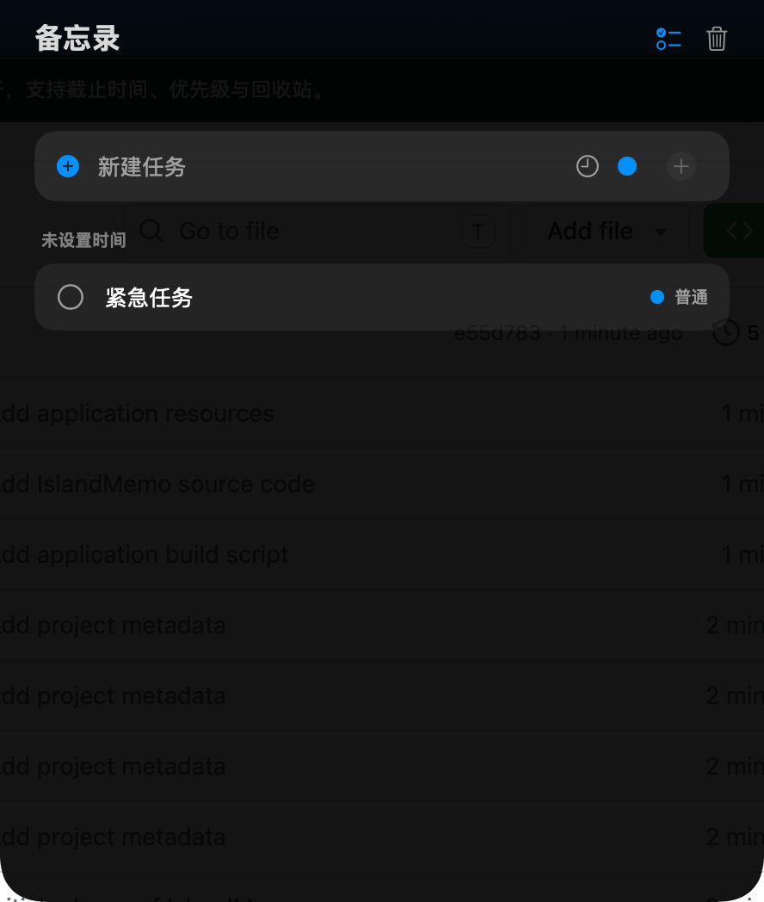

# 丫丫灵动（IslandMemo）

一个轻量、原生的 macOS 菜单栏任务备忘录。单击当前屏幕刘海位置，任务面板便会像“灵动岛”一样展开；也可以使用可自定义的全局快捷键随时唤出。



## 功能

- 单击屏幕刘海位置展开，移开后自动收起
- 支持自定义唤起快捷键，快速打开或关闭面板
- 新建、完成和删除任务
- 设置任务优先级与截止时间
- 在截止前 24 小时、12 小时、6 小时、3 小时、1 小时和 10 分钟发送系统通知
- 按逾期、今天、明天、未来和未设置时间自动分组
- 双击任务名称进行编辑
- 从回收站恢复任务
- 支持多显示器和全屏空间
- 数据仅保存在本机，无需账号或网络连接

## 系统要求

- macOS 13 Ventura 或更高版本
- Swift 6.0 工具链（从源码构建时需要）

## 直接下载安装

[下载丫丫灵动 v0.2.12](https://github.com/lizilong0326/IslandMemo/raw/refs/heads/main/downloads/%E4%B8%AB%E4%B8%AB%E7%81%B5%E5%8A%A8-v0.2.12.zip)

下载后解压，将 `丫丫灵动-v0.2.12.app` 拖入“应用程序”文件夹即可使用。当前安装包采用本地临时签名；如果 macOS 首次打开时阻止运行，请在 Finder 中右键应用并选择“打开”。

## 从源码运行

克隆项目后，在项目目录运行：

```bash
swift run IslandMemo
```

启动后，菜单栏会出现任务列表图标。单击屏幕顶部中央区域，或使用自定义唤起快捷键，即可打开任务面板。

## 打包应用

项目附带了本地打包脚本：

```bash
chmod +x scripts/build-app.sh
./scripts/build-app.sh
```

生成的应用位于项目上级的 `outputs` 目录。脚本使用临时签名，适合本地测试；对外分发时建议使用 Apple Developer 证书签名并完成公证。

## 数据存储

任务保存在：

```text
~/Library/Application Support/IslandMemo/tasks.json
```

卸载应用不会自动删除这份数据。

## 项目结构

```text
IslandMemo/
├── downloads/
├── Package.swift
├── Resources/
├── Sources/IslandMemo/
└── scripts/build-app.sh
```

数据访问统一通过 `TaskRepository`。如果以后需要接入云端同步，可实现远程仓库的 `load` 和 `save`，再在 `AppDelegate` 中替换注入，界面和任务逻辑无需改动。

## 参与开发

欢迎提交问题和改进建议。提交代码前请先阅读 [CONTRIBUTING.md](CONTRIBUTING.md)。

## 许可证

本项目采用 [MIT License](LICENSE)。
