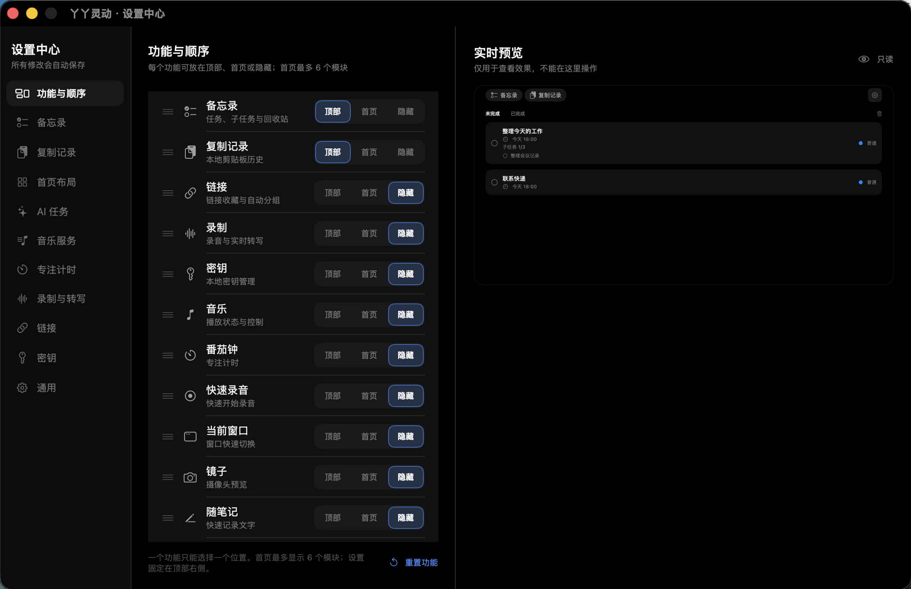

# 丫丫灵动（IslandMemo）

把 Mac 刘海变成一个随手可用的本地工作台。单击当前屏幕顶部中央区域，或使用自定义全局快捷键，即可展开面板；移开后会延时自动收起。


## 界面预览

### 可自由编排的功能入口

每个功能都可以放在顶部 Tab、首页模块或隐藏；首页最多展示 6 个模块，并支持调整顺序与尺寸。



## 主要功能

- **备忘录**：任务、子任务、分类、优先级、截止时间、完成列表与回收站
- **首页工作台**：按需要组合备忘录、时钟、日历、音乐、番茄钟、窗口、镜子等模块
- **复制记录**：在本机保存最近的剪贴板文字与图片，支持数量和保留时长设置
- **链接与常用指令**：收藏链接、自动分组，并快速复制常用提示词或命令
- **录制与转写**：快速录音、管理录音记录，并可配置实时转写服务
- **本地密钥**：通过 macOS 钥匙串保存敏感内容，列表仅展示名称
- **音乐控制**：支持汽水音乐、Apple Music 与 Spotify，可选择首页默认播放器
- **专注工具**：番茄钟、随笔记、时钟、公历月历、农历日期与传统黄历信息
- **窗口与镜子**：快速切换当前窗口，或在面板中打开摄像头预览
- **AI 任务**：查看 Codex 额度、重置时间和最近任务状态，并接收本机 Agent 完成提醒
- **多显示器支持**：可在当前屏幕或全屏空间中唤出面板

## 快捷键与打开方式

- 单击当前屏幕顶部中央区域打开面板
- 在菜单栏选择“打开丫丫灵动”
- 在菜单栏选择“修改快捷键…”，自定义全局唤起快捷键

应用不再固定使用某一组组合键；请按自己的习惯设置，若组合键已被其他应用占用，系统会提示更换。

## 系统要求

- macOS 13 Ventura 或更高版本
- Swift 6.0 工具链（仅从源码构建时需要）
- 查看 Codex 状态时，需要已安装并登录 ChatGPT/Codex

部分功能首次使用时会请求对应的系统权限：镜子需要摄像头权限，录音需要麦克风权限，汽水音乐快捷控制需要辅助功能权限。

## 直接下载安装

[下载丫丫灵动 v0.2.45](https://github.com/lizilong0326/IslandMemo/raw/refs/heads/main/downloads/%E4%B8%AB%E4%B8%AB%E7%81%B5%E5%8A%A8-v0.2.45.zip)

下载后解压，将 `丫丫灵动-v0.2.45.app` 拖入“应用程序”文件夹即可使用。当前安装包采用本地临时签名；如果 macOS 首次打开时阻止运行，请在 Finder 中右键应用并选择“打开”。

## 从源码运行

克隆项目后，在项目目录运行：

```bash
swift run IslandMemo
```

启动后，菜单栏会出现应用图标。单击屏幕顶部中央区域，或使用你设置的全局快捷键，即可打开面板。

## 打包应用

项目附带本地打包脚本：

```bash
chmod +x scripts/build-app.sh
./scripts/build-app.sh
```

生成的应用位于项目上级的 `outputs` 目录。脚本使用临时签名，适合本地测试；对外分发时建议使用 Apple Developer 证书签名并完成公证。

## 数据与隐私

- 任务、设置、链接、录音索引和剪贴板历史默认只保存在本机
- 密钥内容写入 macOS 钥匙串，不会明文写入项目仓库
- Codex 状态模块只通过本机 `codex app-server` 请求额度和最近任务摘要，并只读查询 `~/.codex/thread_history_*.sqlite` 中的任务状态字段
- Codex 状态模块不会读取聊天正文、`auth.json` 或浏览器 Cookie；最后一次成功读取的额度与任务摘要会缓存在 IslandMemo 的 `UserDefaults` 中

任务数据位于：

```text
~/Library/Application Support/IslandMemo/tasks.json
```

卸载应用不会自动删除本地数据。

## 项目结构

```text
IslandMemo/
├── assets/                 # README 图片
├── downloads/              # 可直接下载的应用压缩包
├── Package.swift
├── Resources/
├── Sources/IslandMemo/
├── Tests/
├── THIRD_PARTY_NOTICES.md
└── scripts/build-app.sh
```

数据访问统一通过 `TaskRepository`。如果以后需要接入云端同步，可以实现远程仓库的 `load` 和 `save`，再在 `AppDelegate` 中替换注入，界面和任务逻辑无需改动。

## 参与开发

欢迎提交问题和改进建议。提交代码前请先阅读 [CONTRIBUTING.md](CONTRIBUTING.md)。

## 许可证

本项目采用 [MIT License](LICENSE)。Codex 状态模块包含从 CodexFloat 改编的 MIT 许可代码，详情见 [THIRD_PARTY_NOTICES.md](THIRD_PARTY_NOTICES.md)。
